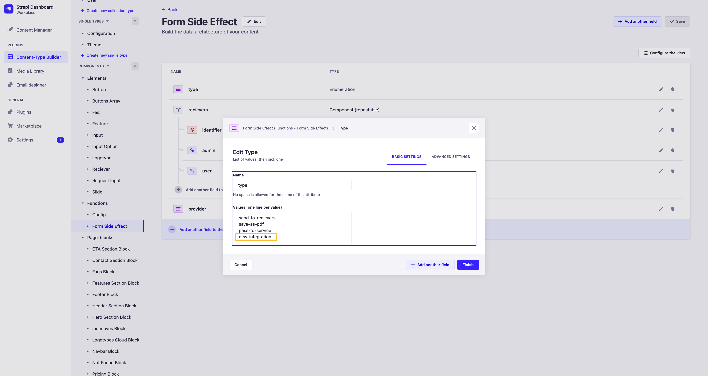

# Подключение формы обратной связи

Для подключения формы обратной связи нужно создать запись в модели Form и настроить ей сайд-эффекты. Для этого нужно перейти на страницу модели Form и создать запись.


При создании новой записи есть поля, определяющие характеристики отображения формы и её логику работы.

- **inputs\*** - поля, отображаемые в форме

  - **placeholder** - плейсхолдер в форме ввода

  - **component\*** - компонент формы, в котором будет отображено поле ввода

  - **is_required\*** - обязательность поля

  - **value** - начальное значение, если оно требуется

  - **name\*** - имя поля ввода, используется для дальнейшей постановки в виде key в модель Form Request

  - **options** - варианты для выбора, если выбран component `listbox`, `radio-group`.

  - **label** - название, которое отображается выше поля ввода

  - **class_name** - дополнительный класс для стилизации

  - **type** - тип, если необходим

  - **multiple** - множественное поле или нет

- **button** - кнопка для отправки формы

- **uid** - идентификатор формы

- **side_effects** - сайд эффекты, отвечающие за последующие действия, которые будут выполнены после её отправки пользователем.

## Side Effects

Конструктор форм имеет функционал настройки действий, которые будут вызваны после её отправки пользователем на страницах сайта. Эти действия называются Side Effects. На данный момент существует несколько вариантов Side Effects.

### Отправить письмо на почту

Действие, которое отправляет данные формы указанным в поле `recievers` получателям. Для отправки данных формы на почту необходимо заполнить поля следующими данными.


#### type

`send-to-recievers`

#### recievers

В данном поле нужно заполнить один из доступных полей ввода

- `identifier` - явное указание получателя, с данном случае почтовый ящик
- `admin` - аккаунт администратора
- `user` - аккаунт пользователя

#### provider

`email` - отправка письма на электорнную почту

### Сохранить данные в виде PDF файла

Действие, которое сохраняет введенные пользователем данные в виде PDF-файла в локальное хранилище или на Google Drive.


#### type

`save-as-pdf`

#### provider

- `local` - для сохранение файла в **Media-Library**.
- `google-drive` - для сохранения файла в Google Drive. Для этого требуется добавить [Configuration](/docs/backend/development/create-configuration) для Google.

### Отправить данные в Google Sheets

Действие, которое сохраняет введенные пользователем данные в Google Sheets.


#### type

`pass-to-service`

#### provider

- `google-sheets` - для сохранения данных в Google Sheets. Требуется добавить [Configuration](/docs/backend/development/create-configuration) для Google.

### Добавление нового Side Effect

Для добавление нового Side Effect надо добавить функцию, которая будет отвечать за выполнение этого действия и параметры, необходимые для выбора данного Side Effect в панели администрирования.

#### Добавление функции

Функции Side Effect хранятся в директории `./backend/src/side-effects`. За выбор вызываемой функции отвечает файл `./backend/src/side-effects/index.js`.

```javascript title="./backend/src/side-effects/index.js"
const saveAsPdf = require("./save-as-pdf");
const sendToRecievers = require("./send-to-recievers");
const passToService = require("./pass-to-service");

async function sideEffectsEmmiter({ event, sideEffect, payload }) {
  if (sideEffect.type === "send-to-recievers") {
    await sendToRecievers({ event, sideEffect, payload });
  } else if (sideEffect.type === "save-as-pdf") {
    await saveAsPdf({ event, sideEffect, payload });
  } else if (sideEffect.type === "pass-to-service") {
    await passToService({ event, sideEffect, payload });
  }
}

module.exports = sideEffectsEmmiter;
```

```javascript title="./backend/src/side-effects/index.js"
...
const newIntegration = require("./new-integration.js");

async function sideEffectsEmmiter({ event, sideEffect, payload }) {
  if (sideEffect.type === "send-to-recievers") {
    ...
  } else if (sideEffect.type === "new-integration") {
    await newIntegration({ event, sideEffect, payload })
  }
}

module.exports = sideEffectsEmmiter;
```

Новая функция добавляется в виде файла, подобно файлу `./backend/src/side-effects/send-to-recievers.js`.

```javascript title="./backend/src/side-effects/new-integration.js"
async function newIntegration({ event, sideEffect, payload }) {
    ...
}

module.exports = newIntegration;
```

- `payload` - данные заполненной формы
- `sideEffect` - данные, введенные администратором при заполнении поля side_effects в модели Form.
- `event` - Strapi lifecycle [событие](https://docs.strapi.io/dev-docs/backend-customization/models#lifecycle-hooks)

#### Добавление параметров Side Effect

Для того, чтобы администратор смог выбрать новый Side Effect необходимо добавить его ключ и дополнительные параметры (если нужно) в Content-Type-Builder [компонента Form Side Effect](http://localhost:1337/admin/plugins/content-type-builder/component-categories/functions/functions.form-side-effect).


Нужно добавить ключ, определяющий выбор данного Side Effect в панели администрирования.


