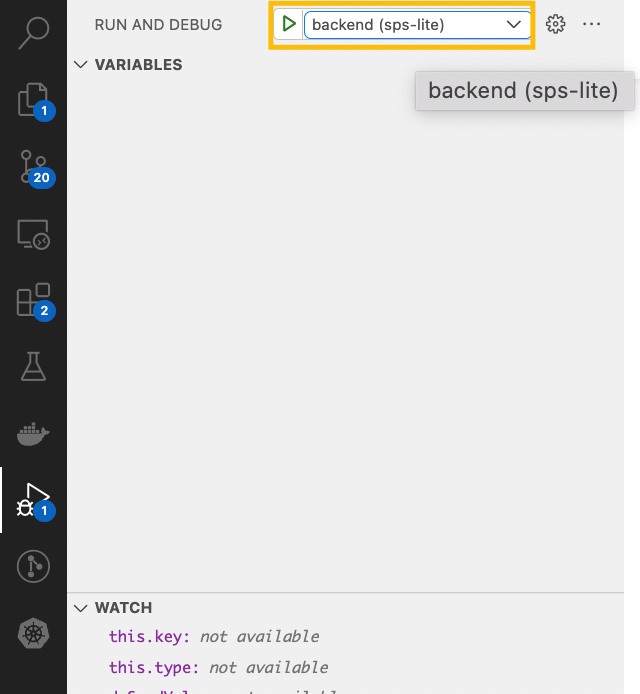

# Установка и запуск

Для запуска бекенда необходимо перейти в директорию `backend` и выполнять все указанные на этой странице команды и действия

## Переменные окружения

Для корректной работы бекенда нужно установить переменные окружения в файлe `.env`

:::info
В директории бекенда есть файл `.env.example`, который является примером файла `.env`
:::

Подробную информацию по доступным переменным среды окружения можно узнать в [Официальной документации Strapi](https://docs.strapi.io/dev-docs/configurations)

Ниже представлены дополнительные переменные среды, которые используются в **Single Page Startup**

```txt title=".env"
APP_NAME="Single Page Startup"
SEED_ENTITES=true
MAKE_NEW_SEED=true

EMAIL_PROVIDER=sendpulse
SENDPULSE_USER_ID=XXXXXXXXXXXXXXXXXXXXXXXXXXXXXX
SENDPULSE_USER_SECRET=XXXXXXXXXXXXXXXXXXXXXXXXXXXXXX
SENDPULSE_ADDRESS_BOOK_ID=XXXXXXXX
SENDPULSE_DEFAULT_FROM=no-reply@<yourstartupdomain.com>
SENDPULSE_DEFAULT_REPLY_TO=support@<yourstartupdomain.com>

AWS_URL=XXXXXXXXX
AWS_ACCESS_KEY_ID=XXXXXXXXXXXXXXXXXX
AWS_ACCESS_SECRET=XXXXXXXXXXXXXXXXXX
AWS_BUCKET=XXXXXXXXX
AWS_REGION=XXXX
AWS_ENDPOINT=XXXXXXXXXXXXXXXXXX
```

:::tip
Мы рекомендуем сразу воспользоваться [управляемыми хостинг-провайдерами базами данных](https://www.digitalocean.com/products/managed-databases-postgresql) и [S3](https://www.digitalocean.com/products/spaces) для хранения файлов

Это нужно чтобы создать надежную и отказоустойчивую инфраструктуру, так как развернутая самостоятельно Postgres может становиться точкой отказа проекта. А хранилище S3 обходится гараздо дешевле, чем зарезервированное пространство на сервере.
:::

### Описание дополнительных переменных среды

| Название        | Описание                                                                                                                                                                                                                                        | Обязательно? | Значение по умолчанию |
| --------------- | ----------------------------------------------------------------------------------------------------------------------------------------------------------------------------------------------------------------------------------------------- | ------------ | --------------------- | --- |
| APP_NAME        | Название проекта, данный параметр будет проставлен как отправитель в письмах отправленных Email плагином Strapi                                                                                                                                 | нет          | Single Page Startup   |
| SEED_ENTITES    | Параметр, определяющий будет ли сделан сидинг данных на основе model/seeds/\*.json файлов                                                                                                                                                       | нет          | undfined              |
| MAKE_NEW_SEED   | Параметр, определяющий будет ли сделан дамп данных на основе данных, добавленных в панели администрирования в файлы model/seeds/\*.json. Нельзя вызывать одновременно с `SEED_ENTITES=true`                                                     | нет          | undfined              |
| EMAIL_PROVIDER  | Используемый провайдер отправки Email-писем. Более подробно про возможные варианты использования можно почитать в [Официальной документации Strapi](https://docs.strapi.io/dev-docs/plugins/email)                                              | нет          | undfined              |
| SENDPULSE\_\*\* | Параметры конфигурации провайдера Email-писем [Sendpulse](https://sendpulse.com/)                                                                                                                                                               | нет          | undefined             |     |
| AWS\_\*\*       | Параметры для настройки S3 хранилища. Мы настоятельно рекомендуем использовать его, так как это позволит вам настроить более надежную инфраструктуру и мигрировать данные в продакшн среду без необходимости вручную переносить файлы на сервер | нет          | undefined             |

## База данных

Для локальной разработки можно использовать [SQLite](https://docs.strapi.io/dev-docs/configurations/database), либо поднять локальную Postgress.

Если вы решили использовать Postgress, то для её запуска необходимо запустить `docker-compose.db.yaml` файл, который находится в `root` директории проекта. Для этого нужно вызвать следующую команду:

```bash title="Inside root folder"
docker compose up -f docker-compose.db.yaml up
```

## Запуск

```bash title="Inside backend folder"
npm install && npm run develop
```

:::info
В последующие разы можно использовать консоль Debugger в VS Code для запуска бекенда, либо вызывать команду:

```bash
npm run develop
```

:::

## Debug-режим

Если вы используете **VS Code**, то вам сразу доступен способ запуска проекта через дебаггер. Для этого откройте вкладку `Run and Debug` в левой части окна **VS Code**.


В открывшемся окне наверху выберите `backend` и нажмите на иконку с треугольником. Во вкладке `Debug console` будет отображаться информация от вебсервера.




## Панель адмнистрирования

После запуска проекта станет доступна панель администрирования по адресу [http://127.0.0.1:1337/admin](http://127.0.0.1:1337/admin). При первом посещении необходимо создать администратора.


После создания пользователя и входа в аккаунт откроется главная страница панели администрирования Strapi. Подробную информация о том что такое Strapi можно узнать в [Официальной документации](https://docs.strapi.io/dev-docs/quick-start).


