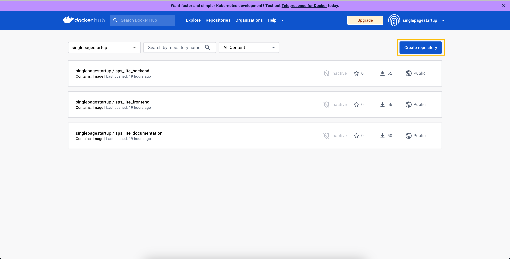
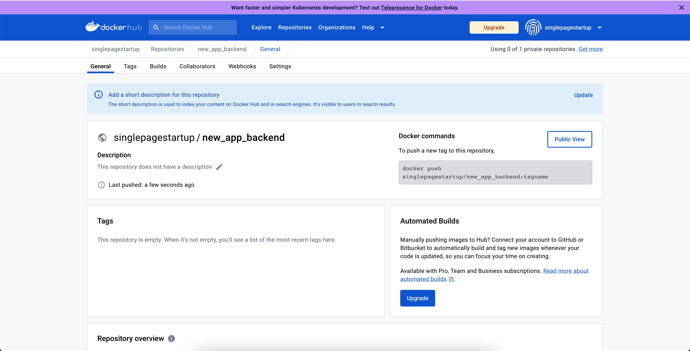

# Docker Images

Проект на базе Single Page Startup можно запустить используя окружение [Docker](https://www.docker.com/) и образы, созданные на основе `Dockerfile`, размещенных в директории `backend` и `frontend`.

:::tip
Для успешного выполнения следующих шагов убедитесь что на машине, где выполняете данные команды установлен Docker:

```bash
✗ docker -v
Docker version 20.10.20, build 9fdeb9c
```

:::

## Система хранения образов

Для того, чтобы сервер получил образы на основе которых будет запущен контейнер фронтенда и бекенда нужно загрузить их в соответствующую систему. Самая популярная их них это [Docker Hub](https://hub.docker.com/).

Для загрузки образов в Docker Hub нужно создать там аккаунт и соответствующие репозитори для фронтенда и бекенда:






## Создание и проверка работоспособности образов на локальной машине

Создать образы бекенда и фронтенда можно выполнив следующие команды в соответствующих директориях.

```bash title="Inside backend folder"
docker build -t backend .
```

```bash title="Inside frontend folder"
docker build -t frontend .
```

После чего данные образы можно запустить через `docker-compose` файлы, находящиеся в `root` директории проекта:

```bash title="Inside root folder"
docker compose up -f docker-compose.db.yaml up
```

Если образы запускаются и работают в штатном режиме, можно отправить их в [Docker Hub](https://hub.docker.com/) или любую другую подобную систему хранения образов Docker.

Для этого надо иметь аккаунт в выбранной системе, после чего аутентифицировать локальную машину, используя команду `docker login`. Затем можно будет загрузить туда созданные образы.

Для загрузки образов нужно затегировать созданные образы в соответствии с вашим аккаунтом и созданными репозиториями

```bash
docker image tag <local_image_name> <docker_hub_account>/<repository_name>:<tag>
```

```bash title="Example | Tagging frontend image"
docker image tag frontend singlepagestartup/new_repo:latest
```

Повторите то же самое для образа бекенда.

:::caution
Если вы используете отличную от Docker Hub систему хранения образов, то вам может понадобиться задать полный путь до аккаунта. Более подробно читайте в документации [Docker](https://docs.docker.com/engine/reference/commandline/push/#all-tags)
:::

После того, как образы затегированы, вы можете отправить их в систему хранения образов. Для этого выполните команду:

```bash
docker image push <docker_hub_account>/<repository_name>:<tag>
```

```bash title="Example | Push frontend image"
docker image push singlepagestartup/new_repo:latest
```

:::info
Мы не рекомендуем создавать образы прямо на сервере, так как создание образов потребляет большое количество ресурсов. Используйте [GitHub Actions](/docs/deployment/#github-actions) для этих нужд.
:::

## GitHub Actions

В проекте, созданном на основе Single Page Startup уже есть файлы для запуска GitHub Actions, они находятся в директории `.github/workflows`. Но для их корректной работы нужно добавить [Secrets](https://docs.github.com/ru/actions/security-guides/encrypted-secrets) параметры в настройки репозитория **GitHub**.

### GitHub Action Secrets

#### DOCKER_HUB_URL

Данный параметр определяет куда отправлять образы, вы можете отправлять образы в **Docker Hub** или использовать другую систему хранения образов.

- `registry.hub.docker.com` - если загрузка должна происходить в [Docker Hub](https://hub.docker.com/)
- `cr.selcloud.ru` - если вы выбрали для себя систему хранения образов от [Selectel](https://selectel.ru/services/cloud/container-registry/)

#### DOCKER_HUB_USERNAME

Директория, в которую будет загружен образ. Если вы используете **Docker Hub**, то этот параметр соответствует имени пользователя. Если вы выбрали другую систему хранения образов, то обратитесь к документации соответствующей системы.

- `singlepagestartup` - для **Docker Hub** параметр соответствует логину аккаунта
- `sps` - для **Selectel** параметр соответствует названию проекта, который вы создали в панели **Container Registry**

#### DOCKER_HUB_LOGIN_USERNAME

Логин, используемый для аутентификации в системе. Для **Docker Hub** он соответсвует логину аккаунта.

- `singlepagestartup` - для **Docker Hub**
- `token` - для **Selectel** он одинаковый у всех пользователей, так как вы аутентифицируетесь по токену

#### DOCKER_HUB_PASSWORD

Пароль для системы хранения образов. В **Docker Hub** он соответствует паролю от аккаунта.

- `<secret_password>` - для **Docker Hub** это пароль от аккаунта
- `<secret_token>` - для **Selectel** это специальный токен, который вы можете получить в панели **Container Registry**

#### APP_NAME

Название проекта или репозитория. Данный параметр проставляется как чать названия будущих образов. Для фронтенда это будет `<APP_NAME>_frontend` и `<APP_NAME>_backend` для бекенда. Именно с такими названиямы нужно создать репозитории в системе хранения образов. Например `sps_lite_frontend` и `sps_lite_backend`.

- `<repository_name>` - название проекта

:::tip
Советуем использовать названия соответсвтующие названию репозитория в `snake_case`.
:::

#### PORTAINER_STAGING_BACKEND_UPDATE_URL

Ссылка для обновления `staging` сервиса бекенда в [Portainer](https://www.portainer.io/). Этот параметр можно проставить после того, как проект будет загружен на сервер.

- `https://<portainer_host.your_domain.com/token>` - адрес обновления `staging` сервиса бекенда в **Portainer**

#### PORTAINER_STAGING_FRONTEND_UPDATE_URL

Ссылка для обновления `staging` сервиса фронтенда в [Portainer](https://www.portainer.io/). Этот параметр можно проставить после того, как проект будет загружен на сервер.

- `https://<portainer_host.your_domain.com/token>` - адрес обновления `staging` сервиса фронтенда в **Portainer**

:::tip
Вы можете использовать только `staging` среду, так как она подразумевает загрузку и скачивание образа на сервере.
:::

:::danger
Нельзя использовать только `production` среду, так как она не подразумевает создание и загрузку образов, а только запуск образа с заданным через [GitHub Releases тегом](https://docs.github.com/en/repositories/releasing-projects-on-github/managing-releases-in-a-repository)
:::

#### PORTAINER_PRODUCTION_BACKEND_UPDATE_URL

Ссылка для обновления `production` сервиса бекенда в [Portainer](https://www.portainer.io/). Этот параметр можно проставить после того, как проект будет загружен на сервер.

- `https://<portainer_host.your_domain.com/token>` - адрес обновления `production` сервиса бекенда в **Portainer**

#### PORTAINER_PRODUCTION_FRONTEND_UPDATE_URL

Ссылка для обновления `production` сервиса фронтенда в [Portainer](https://www.portainer.io/). Этот параметр можно проставить после того, как проект будет загружен на сервер.

- `https://<portainer_host.your_domain.com/token>` - адрес обновления `production` сервиса фронтенда в **Portainer**
